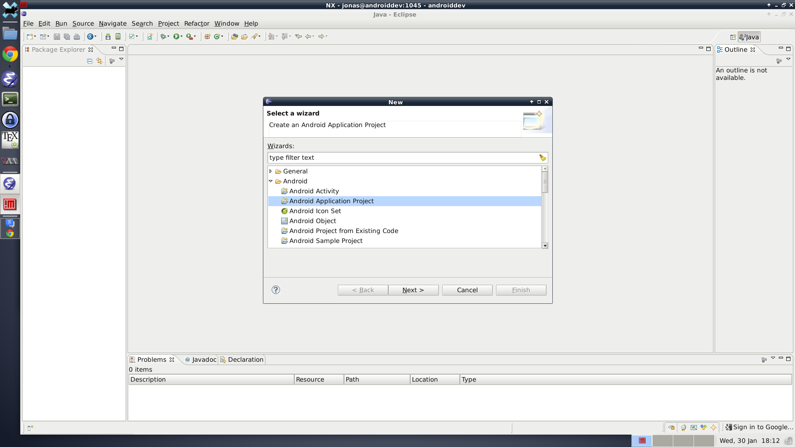
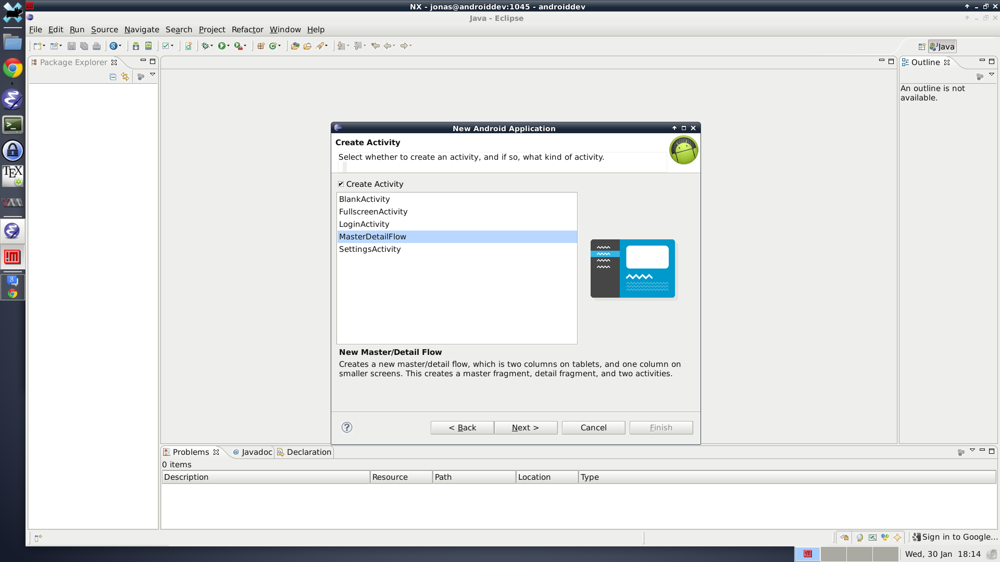
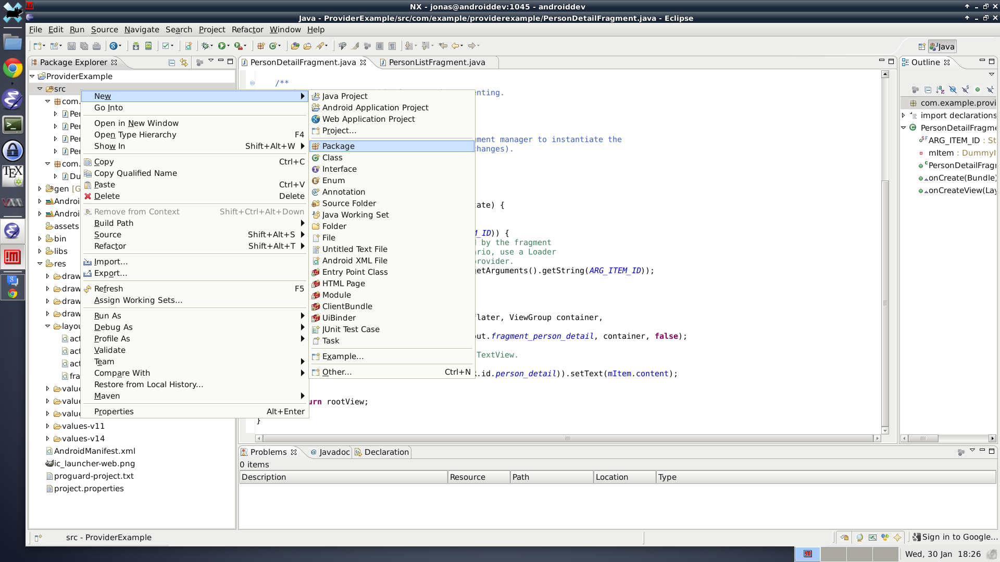
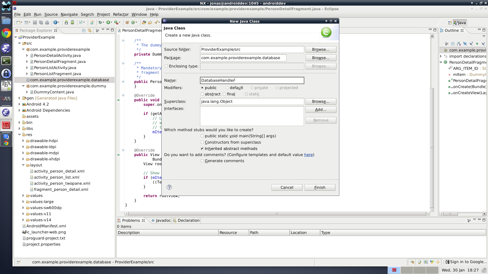
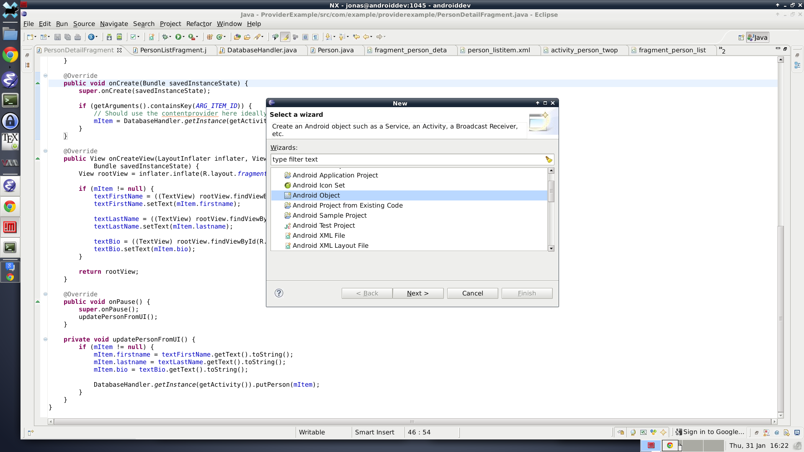
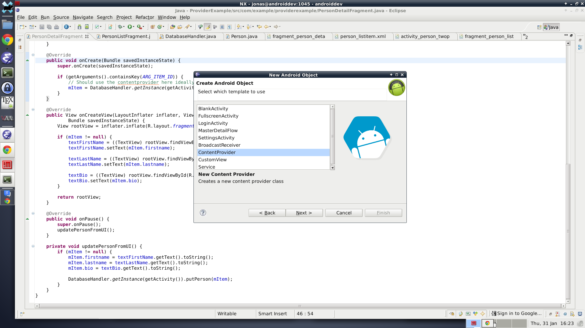
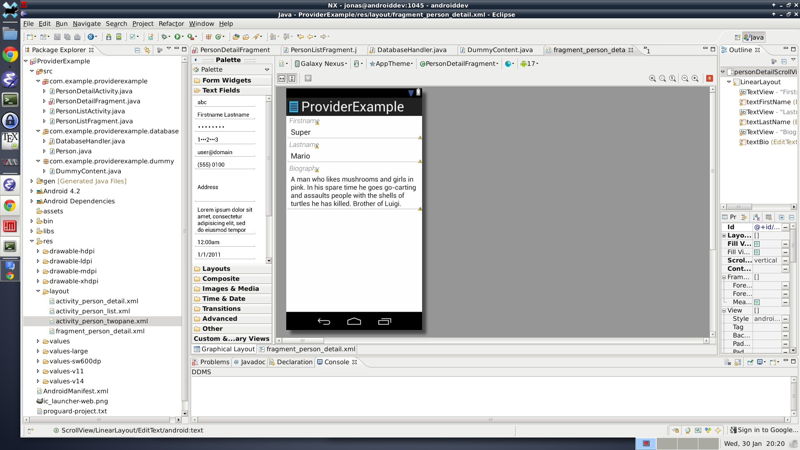

# Things I wish I'd known about sooner: Lists, SQLite and ContentProviders

## Introduction

Lists must be one of the most ubiquitous UI-elements. What app doesn't have them?
If they don't they probably have some kind of grid view. This tutorial will apply
to them both.

### Motivation
Many tutorials only show how to use ArrayAdapters and I find that problematic.
ArrayAdapters are fine if you're showing a static list, but I think most devs
have something more dynamic in mind. Simple rule of thumb is, if the data
backing the list can *change* while the list is displaying it, then you want
to use a ContentProvider.

### What's a ContentProvider
A ContentProvider is seperate from the actual data. In this example, and many
real world applications, the data is stored in an SQLite database. But it doesn't
have to be. We will use the Provider to supply our list with content. The advantage
over a simple ArrayAdapter will be that if the data changes, the list will change,
all by itself, as it happens.

### What's SQLite and why do I want to store data in a database
SQLite is a dialect of SQL, which stands for *Simple Query Language*. There are
many dialects of SQL and this is the one supported by Android. It is a light and
fast version of SQL which does not support all features present in other dialects,
but you can do anything even though you might have to phrase it differently.

The reason you want to store your data in a SQLite database in the first place is
because it is **fast**. I mean deadly **fast**. Properly coded, you can do full text
searches among *millions* of entries in real time.

## Let's start our project
I will be using Eclipse together with the standard SDK only. Target will be Jelly Bean MR2
(Android 4.2), but compatibility will be preserved back to Ice Cream Sandwich.
I am assuming that you have managed to install Eclipse together with the SDK and
are good to go. If not, follow the steps here (LINK!). Make sure you have downloaded
the SDK for the Android version you intend to compile against (in our case, android-17).
This is not the same as the least required android version to run your app.

### Create a new project
Go to the menu, select New, Other, Android Application Project.




I am going to go
with the MasterDetail style to get a nice two-pane view on tablets for free.



I selected to name my "items" Persons.

### A note about Android versions
Many outdated tutorials and things talk about supporting
Android versions as far back as 1.6. Don't. If you really want to reach 95% of the market,
set your minimum requirement to Gingerbread 2.3.3 (this is android-10 in the SDK). The
reason is that several nice APIs and tools were introduced then and not using them is
only stupid. If you only want to make an app for your own enjoyment and actually
have a **modern** device, or were smart enough to get the Nexus S back in the day,
put your least required version to ICS (android-14). ICS also introduced a lot of great
APIs which you don't want to miss out on. Many of them can be used with the support package
but to get the action bar and good looks from ICS, you'll need some library like
ActionBarSherlock, and that's a tutorial for another day.

## Let's make our database
By selecting the MasterDetail style in the wizard, we got a lot of code for free.
You will only need to concern yourself with the two fragment classes, named
*PersonDetailFragment* and *PersonListFragment* in my case. The listFragment
extends ListFragment (surprise), but I'll show how to do this in the general case
in case you want to use a generic fragment (or activity) later.

The wizard created a dummy datastore which is just a fixed array of items. The
first thing we want to do is to replace this with the SQLite database.

### Create the DatabaseHandler
First create a new package for your database (not necessary, it's just nice).
I'll name it "com.example.providerexample.database".



Next, in that package create a new class called "DatabaseHandler".



Once you
have the class open, make it extend "SQLiteOpenHelper" and save.
Eclipse should now complain about SQLiteOpenHelper needing to be
imported. Put the text cursor
somewhere in "SQLiteOpenHelper", hit **CTRL-1**, and select
"import SQLiteOpenHelper.."


Save. Now, we need to implement the needed methods. Put the text cursor instead
somewhere in "DatabaseHandler", **CTRL-1**, "Add unimplemented methods..".


The last thing missing is a constructor. Instead of adding a default one, add
the following code to the top of the class:

```java
	private static final int DATABASE_VERSION = 1;
	private static final String DATABASE_NAME = "providerExample";

	private final Context context;

	public DatabaseHandler(Context context) {
		super(context, DATABASE_NAME, null, DATABASE_VERSION);
		this.context = context;
	}
```

Your project should no longer show any errors. This stage of the project
corresponds to
commit 22a5b48f963eac813ad67b8f2682b8174ff62652.

Before we make any further changes to the DatabaseHandler, let's make a
Person class. We are now doing a kind of DAO/ORM approach
(*Data As Objects* and *Object Relational Mapping* respectively), basically
a Class will be responsible for converting the data stored in the database
into variables useable in the Java code. The advantage of this approach,
as compared to dealing with the database directly everytime is primarily
safety and convenience. Putting all the code associated with a type of
data in one place is good practice. If the data defnition has to change, then
that class should be the only place that needs changes ideally.

### Creating the Person class
So, once again create a new Class in the database package. I name my class
"Person" to be consistent. I now decide that every person will have a
first name, last name (never make that assumption in real life) and a "bio".

The class is fairly simple but it's easier to show the finished result:

```java
package com.example.providerexample.database;

import android.content.ContentValues;
import android.database.Cursor;

/**
 * A class representation of a row in table "Person".
 */
public class Person {

	// SQL convention says Table name should be "singular", so not Persons
	public static final String TABLE_NAME = "Person";
	// Naming the id column with an underscore is good to be consistent
	// with other Android things. This is ALWAYS needed
	public static final String COL_ID = "_id";
	// These fields can be anything you want.
	public static final String COL_FIRSTNAME = "firstname";
	public static final String COL_LASTNAME = "lastname";
	public static final String COL_BIO = "bio";

	// For database projection so order is consistent
	public static final String[] FIELDS = { COL_ID, COL_FIRSTNAME, COL_LASTNAME,
		COL_BIO };

	/*
	 * The SQL code that creates a Table for storing Persons in.
	 * Note that the last row does NOT end in a comma like the others.
	 * This is a common source of error.
	 */
	public static final String CREATE_TABLE =
			"CREATE TABLE " + TABLE_NAME + "("
			+ COL_ID + " INTEGER PRIMARY KEY,"
			+ COL_FIRSTNAME + " TEXT NOT NULL DEFAULT '',"
			+ COL_LASTNAME + " TEXT NOT NULL DEFAULT '',"
			+ COL_BIO + " TEXT NOT NULL DEFAULT ''"
			+ ")";

	// Fields corresponding to database columns
	public long id = -1;
	public String firstname = "";
	public String lastname = "";
	public String bio = "";

	/**
	 * No need to do anything, fields are already set to default values above
	 */
	public Person() {
	}

	/**
	 * Convert information from the database into a Person object.
	 */
	public Person(final Cursor cursor) {
		// Indices expected to match order in FIELDS!
		this.id = cursor.getLong(0);
		this.firstname = cursor.getString(1);
		this.lastname = cursor.getString(2);
		this.bio = cursor.getString(3);
	}

	/**
	 * Return the fields in a ContentValues object, suitable for insertion
	 * into the database.
	 */
	public ContentValues getContent() {
		final ContentValues values = new ContentValues();
		// Note that ID is NOT included here
		values.put(COL_FIRSTNAME, firstname);
		values.put(COL_LASTNAME, lastname);
		values.put(COL_BIO, bio);

		return values;
	}
}
```

This class contains all the necessary information to create the required database
things for Persons. Note that the fields themselves are public. This is a really
simple class and I therefor consider getters/setters for those variables to be
highly unnecessary.

I also want to write the result of the CREATE_TABLE string in plain text here:

```SQL
CREATE TABLE Person(
  _id INTEGER PRIMARY KEY,
  firstname TEXT NOT NULL DEFAULT '',
  lastname TEXT NOT NULL DEFAULT '',
  bio TEXT NOT NULL DEFAULT '')
```

This create a table in the database. Every table of a database must have an ID.
By saying that *_id* is an *integer* and the *primary key*, we make it into the
ID. *primary key* has the property that every newly inserted row gets a unique ID.
The database will **never** allow two rows to have the same ID. This is a very
good thing.

The other columns all share the same definitions, they are *TEXT* which defaults
to the empty string (just like they do in the class Person). But note that it
also has *NOT NULL* defined. This means that they are not allowed to be NULL, ever.
If you try to set a firstname to NULL, the database will protest and crash.
Putting restrictions on the fields inside the database is a good idea, because
you can then be sure of what will come out of it. However, think it through
properly beforehand to make sure you don't set yourself up for stupid things later.

### Finishing the DatabaseHandler
Let's turn our attention back to the DatabaseHandler we created earlier. First
thing we need to do is put something inside *onCreate*. This method is called
the *first* time the database is opened. We need to create our table inside it.
Because we wrote the relevant code in the Person class, this is very straight
forward. This is the complete *onCreate* method:

```java
    @Override
	public void onCreate(SQLiteDatabase db) {
		db.execSQL(Person.CREATE_TABLE);
	}
```

Let's leave *onUpgrade* for now. This method is called when the database version
has changed. The version is defined at the top of the class in constant
**DATABASE_VERSION = 1**. If you need to make changes to your database, increment
this value and put any relevant code to *upgrade* the database in the *onUpgrade*
method. We will get to an example of this later. All you have to have in mind now
is that you can change the database as your app matures. You can add/remove tables,
and also add columns to existing tables. The only thing you can't do is remove
columns from existing tables (not a big problem, just ignore them in that case) or
add/change/remove the *restrictions* you defined in the table creation
(like *NOT NULL*).

OK, the table will be created for us, good. But we can't really do anything yet.
We need to be able to do stuff with persons. To start with, we want to be able to
do the following: add/update a person, remove a person and of course get a person.

Let's add methods corresponding to those cases:

```java
	public Person getPerson(final long id) {
		// TODO
		return null;
	}

	public boolean putPerson(final Person person) {
		// TODO
        return false;
	}

	public int removePerson(final Person person) {
		// TODO
        return 0;
	}
```

Some might notice that I do not have separate insert and update methods.
Your case might differ but I find that if my code wants to save a person,
then it wants to save it regardless if it is already present in the
database or not.

We are now at commit c2a050d32455eb292c1aec35dc49dcf41c69873d.

Let's start with *getPerson*. All we want to do is query the database
for a row with the specified id.

```java
	public Person getPerson(final long id) {
		final SQLiteDatabase db = this.getReadableDatabase();
		final Cursor cursor = db.query(Person.TABLE_NAME,
				Person.FIELDS, Person.COL_ID + " IS ?",
				new String[] { String.valueOf(id) }, null, null, null, null);
		if (cursor == null || cursor.isAfterLast()) {
			return null;
		}

		Person item = null;
		if (cursor.moveToFirst()) {
			item = new Person(cursor);
		}
		cursor.close();
		db.close();
		return item;
	}
```

Here the advantage of the Person's cursor constructor should be clear. But make
sure the cursor is pointing at the correct row before with *moveToFirst* or
*moveToNext* depending on your use case. The method returns **null** if no
row in the database matches the specified ID. IDs start at 1, so -1 is
always a safe default value. The delete method is similarly simple:

```java
	public int removePerson(final Person person) {
		final SQLiteDatabase db = this.getWritableDatabase();
		final int result = db.delete(Person.TABLE_NAME,
				Person.COL_ID + " IS ?",
				new String[] { Long.toString(person.id) });
		db.close();
        return result;
	}
```

The result is the number
of rows that were deleted. In this case it should never be anything except
zero or one. Finally, *putPerson*. It's a little longer, but that's only
because it is both an insert and an update method.

First, we try to update the person. If that fails, we insert it instead.

```java
	public boolean putPerson(final Person person) {
		boolean success = false;
		int result = 0;
		final SQLiteDatabase db = this.getWritableDatabase();

		if (person.id > -1) {
			result += db.update(Person.TABLE_NAME, person.getContent(),
					Person.COL_ID + " IS ?",
					new String[] { String.valueOf(person.id) });
		}

		if (result > 0) {
			success = true;
		} else {
			// Update failed or wasn't possible, insert instead
			final long id = db.insert(Person.TABLE_NAME, null,
					person.getContent());

			if (id > -1) {
				person.id = id;
				success = true;
			}
		}

		db.close();

		return success;
	}
```

Our ORM layer is complete. This is at commit b6a3a519ae45c762b98e43c6a8455147303fa06b.
Using Person as a base, it is fairly easy to add additional tables to the database.
All we need are get,put and remote methods in the database handler and we're set.
Changes made to Person basically never have to touch the database handler ever.
This will be very nice during development when you realize that you forgot
a column that you needed. Only changes needed in the Person class, reinstall the
app and you're good to go.


## Making a ContentProvider
We will only be concerned with reading data from the database with our provider
at first, so making it will be quick. First we need to create the shell of the
class. The newer versions of the Android SDK make this easy. Go to New ->
Other. Then select "Android Object".



Next select "ContentProvider" from the list!



It's important to keep in mind what you type as your authority. It should
basically be "your.package.provider", but that's just a convention I read
somewhere. It would be anything but must be unique to your application.
I went with *com.example.providerexample.provider*. Exported isn't needed
as we will only use the provider internally so far.


Now you have the shell of a Provider done! This is the complete generated class:

```java
public class PersonProvider extends ContentProvider {
	public PersonProvider() {
	}

	@Override
	public int delete(Uri uri, String selection, String[] selectionArgs) {
		// Implement this to handle requests to delete one or more rows.
		throw new UnsupportedOperationException("Not yet implemented");
	}

	@Override
	public String getType(Uri uri) {
		// TODO: Implement this to handle requests for the MIME type of the data
		// at the given URI.
		throw new UnsupportedOperationException("Not yet implemented");
	}

	@Override
	public Uri insert(Uri uri, ContentValues values) {
		// TODO: Implement this to handle requests to insert a new row.
		throw new UnsupportedOperationException("Not yet implemented");
	}

	@Override
	public boolean onCreate() {
		// TODO: Implement this to initialize your content provider on startup.
		return false;
	}

	@Override
	public Cursor query(Uri uri, String[] projection, String selection,
			String[] selectionArgs, String sortOrder) {
		// TODO: Implement this to handle query requests from clients.
		throw new UnsupportedOperationException("Not yet implemented");
	}

	@Override
	public int update(Uri uri, ContentValues values, String selection,
			String[] selectionArgs) {
		// TODO: Implement this to handle requests to update one or more rows.
		throw new UnsupportedOperationException("Not yet implemented");
	}
}
```

Since we only care about reading persons so far, we only need to concern
ourselves with the *onCreate* and *query* methods. We also need to come
up with a *URI*, basically a path that we can use to differentiate between
different queries.

Start by adding the following fields at the top of the Provider:

```java
	// All URIs share these parts
	public static final String AUTHORITY = "com.example.providerexample.provider";
	public static final String SCHEME = "content://";

	// URIs
	// Used for all persons
	public static final String PERSONS = SCHEME + AUTHORITY + "/person";
	public static final Uri URI_PERSONS = Uri.parse(PERSONS);
	// Used for a single person, just add the id to the end
	public static final String PERSON_BASE = PERSONS + "/";
```

Change the *onCreate* method to:

```java
    @Override
	public boolean onCreate() {
		return true;
	}
```

The *query* method is not that complicated either. This is the shell we
are working from:

```java
    @Override
	public Cursor query(Uri uri, String[] projection, String selection,
			String[] selectionArgs, String sortOrder) {
		Cursor result = null;
		if (URI_PERSONS.equals(uri)) {

		}
		else if (uri.toString().startsWith(PERSON_BASE)) {

		}
		else {
		throw new UnsupportedOperationException("Not yet implemented");
		}

		return result;
	}
```

Either you can get a cursor of all persons, or you can get a cursor with
a single person. The single person operation is already implemented in
getPerson(), so doing basically the same we get:

```java
            final long id = Long.parseLong(uri.getLastPathSegment());
			result = DatabaseHandler
					.getInstance(getContext())
					.getReadableDatabase()
					.query(Person.TABLE_NAME, Person.FIELDS,
							Person.COL_ID + " IS ?",
							new String[] { String.valueOf(id) }, null, null,
							null, null);
```

Getting all persons is even simpler:

```java
			result = DatabaseHandler
					.getInstance(getContext())
					.getReadableDatabase()
					.query(Person.TABLE_NAME, Person.FIELDS, null, null, null,
							null, null, null);
```

You can note that I am outright ignoring the selection and order parameters
of the provider method, as well as the projection. I don't care about selections
so far because there is no use case for them yet. The projection I ignore
because the only valid projection is defined in the Person class, as far as
I care. This is very convenient if we ever make use of a ViewBinder.

We're not completely done yet however. The provider works, in the sense that
it will return cursors with the result. But we also want that to update
whenever the database updates. To do that, we have to notify listeners
on the URIs that things have changed. To do that, turn back to the
DatabaseHandler.

Every time something changes, we must notify the listeners. Only two methods
change the content, and that is *removePerson* and *putPerson*. First, make
a new method that does the actual notifying:

```java
	private void notifyProviderOnPersonChange() {
		context.getContentResolver().notifyChange(
				PersonProvider.URI_PERSONS, null, false);
	}
```

And call that method any time something changes. *putPerson* gets this added
before its return statement:

```java
        if (success) {
			notifyProviderOnPersonChange();
		}
```

And similarly for *removePerson*:

```java
		if (result > 0) {
			notifyProviderOnPersonChange();
		}
```

That's it. We're done. Here are the complete *PersonProvider* and *DatabaseHandler* classes before we move on to displaying the content:

```java
public class DatabaseHandler extends SQLiteOpenHelper {

	private static DatabaseHandler singleton;

	public static DatabaseHandler getInstance(final Context context) {
		if (singleton == null) {
			singleton = new DatabaseHandler(context);
		}
		return singleton;
	}

	private static final int DATABASE_VERSION = 1;
	private static final String DATABASE_NAME = "providerExample";

	private final Context context;

	public DatabaseHandler(Context context) {
		super(context, DATABASE_NAME, null, DATABASE_VERSION);
		this.context = context;
	}

	@Override
	public void onCreate(SQLiteDatabase db) {
		db.execSQL(Person.CREATE_TABLE);
	}

	@Override
	public void onUpgrade(SQLiteDatabase db, int oldVersion, int newVersion) {
	}

	public synchronized Person getPerson(final long id) {
		final SQLiteDatabase db = this.getReadableDatabase();
		final Cursor cursor = db.query(Person.TABLE_NAME, Person.FIELDS,
				Person.COL_ID + " IS ?", new String[] { String.valueOf(id) },
				null, null, null, null);
		if (cursor == null || cursor.isAfterLast()) {
			return null;
		}

		Person item = null;
		if (cursor.moveToFirst()) {
			item = new Person(cursor);
		}
		cursor.close();
		return item;
	}

	public synchronized boolean putPerson(final Person person) {
		boolean success = false;
		int result = 0;
		final SQLiteDatabase db = this.getWritableDatabase();

		if (person.id > -1) {
			result += db.update(Person.TABLE_NAME, person.getContent(),
					Person.COL_ID + " IS ?",
					new String[] { String.valueOf(person.id) });
		}

		if (result > 0) {
			success = true;
		} else {
			// Update failed or wasn't possible, insert instead
			final long id = db.insert(Person.TABLE_NAME, null,
					person.getContent());

			if (id > -1) {
				person.id = id;
				success = true;
			}
		}

		if (success) {
			notifyProviderOnPersonChange();
		}

		return success;
	}

	public synchronized int removePerson(final Person person) {
		final SQLiteDatabase db = this.getWritableDatabase();
		final int result = db.delete(Person.TABLE_NAME,
				Person.COL_ID + " IS ?",
				new String[] { Long.toString(person.id) });

		if (result > 0) {
			notifyProviderOnPersonChange();
		}
		return result;
	}

	private void notifyProviderOnPersonChange() {
		context.getContentResolver().notifyChange(
				PersonProvider.URI_PERSONS, null, false);
	}
}
```

```java
public class PersonProvider extends ContentProvider {

	// All URIs share these parts
	public static final String AUTHORITY = "com.example.providerexample.provider";
	public static final String SCHEME = "content://";

	// URIs
	// Used for all persons
	public static final String PERSONS = SCHEME + AUTHORITY + "/person";
	public static final Uri URI_PERSONS = Uri.parse(PERSONS);
	// Used for a single person, just add the id to the end
	public static final String PERSON_BASE = PERSONS + "/";

	public PersonProvider() {
	}

	@Override
	public int delete(Uri uri, String selection, String[] selectionArgs) {
		// Implement this to handle requests to delete one or more rows.
		throw new UnsupportedOperationException("Not yet implemented");
	}

	@Override
	public String getType(Uri uri) {
		// TODO: Implement this to handle requests for the MIME type of the data
		// at the given URI.
		throw new UnsupportedOperationException("Not yet implemented");
	}

	@Override
	public Uri insert(Uri uri, ContentValues values) {
		// TODO: Implement this to handle requests to insert a new row.
		throw new UnsupportedOperationException("Not yet implemented");
	}

	@Override
	public boolean onCreate() {
		return true;
	}

	@Override
	public Cursor query(Uri uri, String[] projection, String selection,
			String[] selectionArgs, String sortOrder) {
		Cursor result = null;
		if (URI_PERSONS.equals(uri)) {
			result = DatabaseHandler
					.getInstance(getContext())
					.getReadableDatabase()
					.query(Person.TABLE_NAME, Person.FIELDS, null, null, null,
							null, null, null);
		} else if (uri.toString().startsWith(PERSON_BASE)) {
			final long id = Long.parseLong(uri.getLastPathSegment());
			result = DatabaseHandler
					.getInstance(getContext())
					.getReadableDatabase()
					.query(Person.TABLE_NAME, Person.FIELDS,
							Person.COL_ID + " IS ?",
							new String[] { String.valueOf(id) }, null, null,
							null, null);
		} else {
			throw new UnsupportedOperationException("Not yet implemented");
		}

		return result;
	}

	@Override
	public int update(Uri uri, ContentValues values, String selection,
			String[] selectionArgs) {
		// TODO: Implement this to handle requests to update one or more rows.
		throw new UnsupportedOperationException("Not yet implemented");
	}
}
```

## Making some layouts
Let's get ready to use our new database. Obviously the layouts provided by the wizard
aren't optimized to display information about our Persons. Let's remedy that!

### Detail view
Persons are display in "fragment_person_detail.xml", replace the contents
with the following to get a more interesting view:

```XML
<ScrollView xmlns:android="http://schemas.android.com/apk/res/android"
    android:id="@+id/personDetailScrollView"
    android:layout_width="fill_parent"
    android:layout_height="fill_parent" >

    <LinearLayout
        android:layout_width="fill_parent"
        android:layout_height="fill_parent"
        android:orientation="vertical" >

        <TextView
            android:layout_width="wrap_content"
            android:layout_height="wrap_content"
            android:layout_marginLeft="8dp"
            android:fontFamily="sans-serif-light"
            android:text="Firstname"
            android:textColor="#ff707070"
            android:textSize="18sp" />

        <EditText
            android:id="@+id/textFirstName"
            android:layout_width="fill_parent"
            android:layout_height="wrap_content"
            android:hint="Your first name"
            android:inputType="textPersonName"
            android:textColor="#ff222222"
            android:textSize="20sp" />

        <TextView
            android:layout_width="wrap_content"
            android:layout_height="wrap_content"
            android:layout_marginLeft="8dp"
            android:fontFamily="sans-serif-light"
            android:text="Lastname"
            android:textColor="#ff707070"
            android:textSize="18sp" />

        <EditText
            android:id="@+id/textLastName"
            android:layout_width="fill_parent"
            android:layout_height="wrap_content"
            android:hint="Your last name"
            android:inputType="textPersonName"
            android:textColor="#ff222222"
            android:textSize="20sp" />

        <TextView
            android:layout_width="wrap_content"
            android:layout_height="wrap_content"
            android:layout_marginLeft="8dp"
            android:fontFamily="sans-serif-light"
            android:text="Biography"
            android:textColor="#ff707070"
            android:textSize="18sp" />

        <EditText
            android:id="@+id/textBio"
            android:layout_width="match_parent"
            android:layout_height="wrap_content"
            android:hint="Type anything here"
            android:inputType="textMultiLine|textAutoCorrect"
            android:textColor="#ff222222"
            android:textSize="20sp" />
    </LinearLayout>

</ScrollView>
```

This will look like this:



The whole thing is wrapped in a scrollview to allow people to have really long
biographies even on small screens.

### List item view
Using Androids provided one or two line list items is so boring. Let's make
something nicer.

#### Create a drawable
Create a folder called "drawable" in the res folder. It should live beside the other
drawable folders you already got.

Then create a new XML file named "rounded_corners_white.xml" in drawables. Put
the following in it:

```XML
<?xml version="1.0" encoding="utf-8"?>
<layer-list xmlns:android="http://schemas.android.com/apk/res/android">

    <!-- Bottom 2dp Shadow -->
    <item
        android:left="0dp"
        android:right="0dp" >
        <shape  android:shape="rectangle">

            <solid android:color="#d8d8d8" />
            <corners android:radius="2dp" />

        </shape>
    </item>

    <!-- White Top color -->
    <item android:bottom="2dp"
        android:left="0dp"
        android:right="0dp" >

        <shape  android:shape="rectangle">

        <solid android:color="#FFFFFF" />
        <corners android:radius="2dp" />

        </shape>

    </item>

</layer-list>
```

#### Create the list item

Create a new layout xml file called "person_listitem.xml", make the
root view a linear vertical layout.


You want the file contents to look like:

```XML
<?xml version="1.0" encoding="utf-8"?>
<LinearLayout xmlns:android="http://schemas.android.com/apk/res/android"
    xmlns:tools="http://schemas.android.com/tools"
    android:layout_width="match_parent"
    android:layout_height="wrap_content"
    android:layout_marginTop="6dp"
    android:background="@drawable/rounded_corners_white"
    android:descendantFocusability="blocksDescendants"
    android:orientation="vertical"
    android:paddingBottom="8dp"
    android:paddingLeft="0dp"
    android:paddingRight="0dp"
    tools:context=".MainActivity" >

    <TextView
        android:id="@+id/cardFirstName"
        android:layout_width="match_parent"
        android:layout_height="wrap_content"
        android:paddingLeft="4dp"
        android:paddingRight="4dp"
        android:textColor="#ff707070"
        android:textSize="23sp" />

    <TextView
        android:id="@+id/cardLastName"
        android:layout_width="match_parent"
        android:layout_height="wrap_content"
        android:paddingLeft="4dp"
        android:paddingRight="4dp"
        android:textColor="#ff707070"
        android:textSize="23sp" />

    <View
        android:id="@+id/cardStatus"
        android:layout_width="fill_parent"
        android:layout_height="1dp"
        android:layout_marginTop="4dp"
        android:background="@android:color/holo_blue_light"
        android:visibility="visible" />

    <TextView
        android:id="@+id/cardDescription"
        android:layout_width="match_parent"
        android:layout_height="wrap_content"
        android:layout_marginTop="4dp"
        android:paddingLeft="4dp"
        android:paddingRight="4dp"
        android:textColor="#ff8d8d8d"
        android:textSize="16sp" />

</LinearLayout>
```

#### Create a new list layout
Create a new layout xml called "fragment_person_list.xml". This is
its content:

```XML
<?xml version="1.0" encoding="utf-8"?>
<ListView xmlns:android="http://schemas.android.com/apk/res/android"
    android:layout_width="match_parent"
    android:layout_height="match_parent"
    android:id="@id/android:list"
    android:drawSelectorOnTop="true"
    android:background="#e5e5e5" />
```

This is a straight up list view with a grey background and it draws
selectors on top. The items in the list will now look like this:


We are now at commit 1a0b5e10466e1cf0500c698bb95cb2a241ec91bb.

## Make the app use the new layouts and load the data
By now you should have one or two compiler errors because we removed
some things that was used in the fragments. Now we fix the errors
by making use of our new layouts instead.

### Fixing details fragment
Open "PersonDetailFragment.java" and you should be presented with this class:

```java
public class PersonDetailFragment extends Fragment {
    /**
     * The fragment argument representing the item ID that this fragment
     * represents.
     */
    public static final String ARG_ITEM_ID = "item_id";

    /**
     * The dummy content this fragment is presenting.
     */
    private DummyContent.DummyItem mItem;

    /**
     * Mandatory empty constructor for the fragment manager to instantiate the
     * fragment (e.g. upon screen orientation changes).
     */
    public PersonDetailFragment() {
    }

    @Override
    public void onCreate(Bundle savedInstanceState) {
        super.onCreate(savedInstanceState);

        if (getArguments().containsKey(ARG_ITEM_ID)) {
            // Load the dummy content specified by the fragment
            // arguments. In a real-world scenario, use a Loader
            // to load content from a content provider.
            mItem = DummyContent.ITEM_MAP.get(getArguments().getString(ARG_ITEM_ID));
        }
    }

    @Override
    public View onCreateView(LayoutInflater inflater, ViewGroup container,
            Bundle savedInstanceState) {
        View rootView = inflater.inflate(R.layout.fragment_person_detail, container, false);

        // Show the dummy content as text in a TextView.
        if (mItem != null) {
            ((TextView) rootView.findViewById(R.id.person_detail)).setText(mItem.content);
        }

        return rootView;
    }
}
```

Starting from the top, we have to change from the dummy class to the
Person class, use the databasehandler to get the person object and
finally use the new layout we made earlier.

Additionally, we will save any updates we make in the onPause method.
That way, the content is saved everytime the screen goes off or the
fragment goes away.

The result:

```java
public class PersonDetailFragment extends Fragment {
    /**
     * The fragment argument representing the item ID that this fragment
     * represents.
     */
    public static final String ARG_ITEM_ID = "item_id";

    /**
     * The person this fragment is presenting.
     */
    private Person mItem;

    /**
     * The UI elements showing the details of the Person
     */
    private TextView textFirstName;
    private TextView textLastName;
    private TextView textBio;

    /**
     * Mandatory empty constructor for the fragment manager to instantiate the
     * fragment (e.g. upon screen orientation changes).
     */
    public PersonDetailFragment() {
    }

    @Override
    public void onCreate(Bundle savedInstanceState) {
        super.onCreate(savedInstanceState);

        if (getArguments().containsKey(ARG_ITEM_ID)) {
        	// Should use the contentprovider here ideally
            mItem = DatabaseHandler.getInstance(getActivity()).getPerson(getArguments().getLong(ARG_ITEM_ID));
        }
    }

    @Override
    public View onCreateView(LayoutInflater inflater, ViewGroup container,
            Bundle savedInstanceState) {
        View rootView = inflater.inflate(R.layout.fragment_person_detail, container, false);

        if (mItem != null) {
            textFirstName = ((TextView) rootView.findViewById(R.id.textFirstName));
            textFirstName.setText(mItem.firstname);

            textLastName = ((TextView) rootView.findViewById(R.id.textLastName));
            textLastName.setText(mItem.lastname);

            textBio = ((TextView) rootView.findViewById(R.id.textBio));
            textBio.setText(mItem.bio);
        }

        return rootView;
    }

    @Override
    public void onPause() {
    	super.onPause();
    	updatePersonFromUI();
    }

    private void updatePersonFromUI() {
    	if (mItem != null) {
    		mItem.firstname = textFirstName.getText().toString();
    		mItem.lastname = textLastName.getText().toString();
    		mItem.bio = textBio.getText().toString();

    		DatabaseHandler.getInstance(getActivity()).putPerson(mItem);
        }
    }
}
```

### Fixing list view
