# Things I wish I'd known about sooner: Lists, SQLite and ContentProviders

This tutorial is good if you want to learn about SQLite and how to use it effectively
in Android. I have upgraded the project to Android Studio so some of the
Eclipse-centric content is slightly out-dated, but the gist of it is the same.
All the same functionality is present in Android Studio as it was in Eclipse,
with the same kind of wizards etc. You can also enable a setting in Android Studio
so most of the key commands are the same.

## Introduction

Lists must be one of the most ubiquitous UI-elements. What app doesn't have them?
If they don't they probably have some kind of grid view. This tutorial will apply
to them both. The final result will look like this:

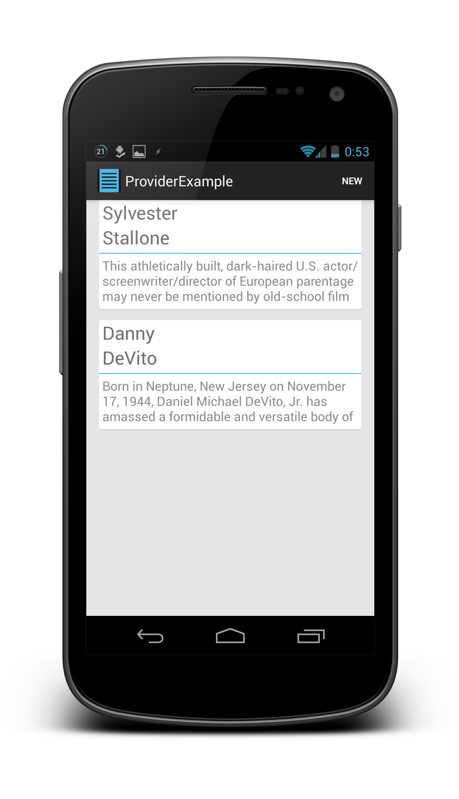

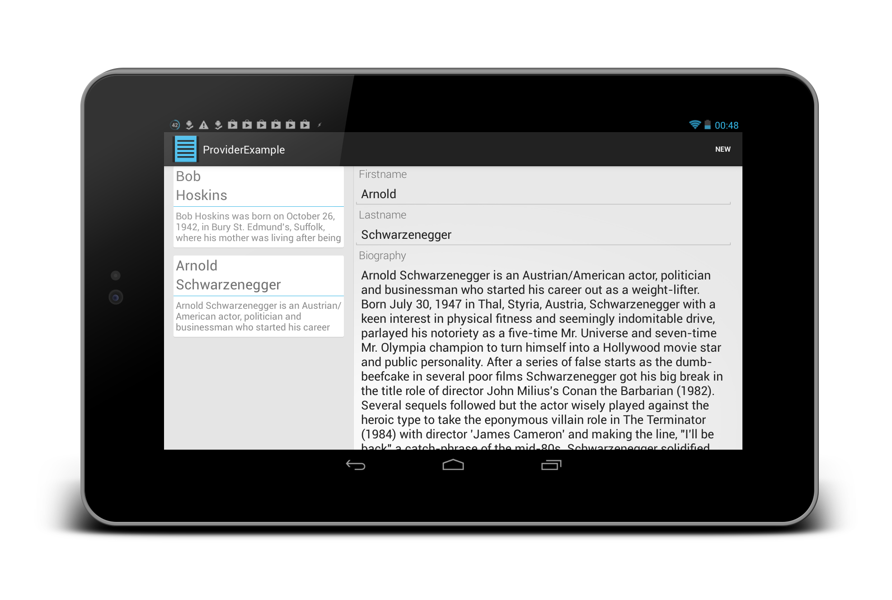

The structure of the tutorial might not be common. I am going to start by
creating the app, documenting all the steps on the way. Once that's done,
I will explain some things in more detail.

To start with, we're going to have to start a new project. This means there
will be a small amount of boiler plate to deal with before we can actually
get our code running.

Somewhere in the middle, I will be taking a detour to make those nice looking layouts.
If you don't care about the layout stuff, just skip that section.

The final step is to make the app use the new layouts, and load the data
from our database into them.

Once the app is complete, I can explain a few things in more detail by
pointing to the code just created.


### Motivation
Many tutorials only show how to use ArrayAdapters and I find that problematic.
ArrayAdapters are fine if you're showing a static list, but I think most devs
have something more dynamic in mind. Simple rule of thumb is, if the data
backing the list can *change* while the list is displaying it, then you want
to use a ContentProvider. While it isn't the only way to get everything working,
together with Loaders, it's just very smooth. The data is fetched on a
background thread and is always up to date. And the system does it all
for you (as long as you have a ContentProvider). What's not to like?

### What's a ContentProvider
A ContentProvider is seperate from the actual data. In this example, and many
real world applications, the data is stored in an SQLite database. But it doesn't
have to be. We will use the Provider to supply our list with content. The advantage
over a simple ArrayAdapter will be that if the data changes, the list will change,
all by itself, as it happens.

### What's a Loader
Loader is a class offered by the Android Framework. It loads (surprise) data
in a background thread and offers a callback interface to allow you to
use that data once it's loaded. We will focus entirely on the case of using
the Loader together with a database cursor. You can use a Loader to load
anything in the background though. So if you have data stored as txt files,
you can use a Loader then as well.

### What's SQLite and why do I want to store data in a database
SQLite is a dialect of SQL, which stands for *Structured Query Language*. There are
many dialects of SQL and this is the one supported by Android. It is a light and
fast version of SQL which does not support all features present in other dialects,
but you can do anything even though you might have to phrase it differently.

The reason you want to store your data in a SQLite database in the first place is
because it is **fast**. I mean deadly **fast**. Properly coded, you can do full text
searches among *millions* of entries in real time.

## Let's start our project
I will be using Eclipse together with the standard SDK only. Target will be Jelly Bean MR2
(Android 4.2), but compatibility will be preserved back to Ice Cream Sandwich.
I am assuming that you have managed to install Eclipse together with the SDK and
are good to go. If not, follow the steps [here](http://developer.android.com/sdk/installing/bundle.html). Make sure you have downloaded
the SDK for the Android version you intend to compile against (in our case, android-17).
This is not the same as the least required android version to run your app.

### Create a new project
Go to the menu, select New, Other, Android Application Project.


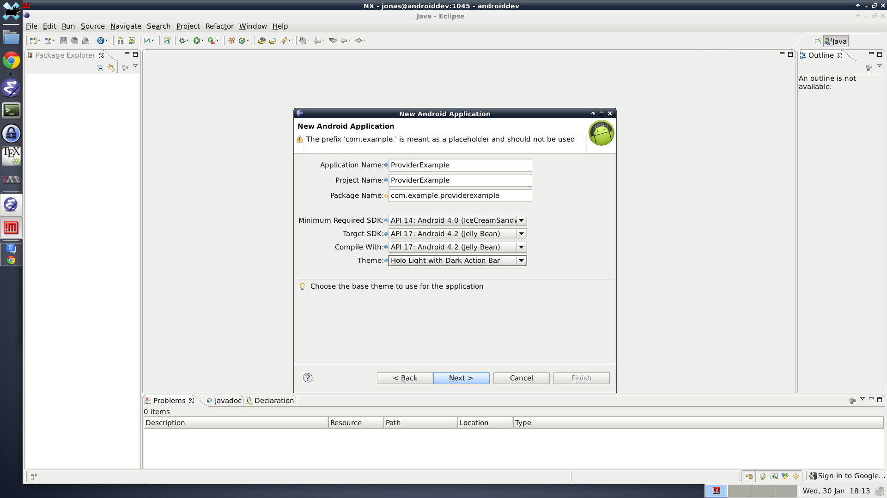

I am going to go
with the MasterDetail style to get a nice two-pane view on tablets for free.


I selected to name my "items" Persons.

### A note about Android versions
Many outdated tutorials and things talk about supporting
Android versions as far back as 1.6. Don't. If you really want to reach 95% of the market,
set your minimum requirement to Gingerbread 2.3.3 (this is android-10 in the SDK). The
reason is that several nice APIs and tools were introduced then and not using them is
only stupid. If you only want to make an app for your own enjoyment and actually
have a **modern** device, or were smart enough to get the Nexus S back in the day,
put your least required version to ICS (android-14). ICS also introduced a lot of great
APIs which you don't want to miss out on. Many of them can be used with the support package
but to get the action bar and good looks from ICS, you'll need some library like
ActionBarSherlock, and that's a tutorial for another day. The project wizard
adds the support library by default, so staying backwards compatible shouldn't
be too hard.

## Let's make our database
By selecting the MasterDetail style in the wizard, we got a lot of code for free.
You will only need to concern yourself with the two fragment classes, named
*PersonDetailFragment* and *PersonListFragment* in my case. The listFragment
extends ListFragment (surprise), but I'll show how to do this in the general case
in case you want to use a generic fragment (or activity) later.

The wizard created a dummy datastore which is just a fixed array of items. The
first thing we want to do is to replace this with the SQLite database.

### Create the DatabaseHandler
First create a new package for your database (not necessary, it's just nice).
I'll name it "com.example.providerexample.database".


Next, in that package create a new class called "DatabaseHandler".


Once you
have the class open, make it extend "SQLiteOpenHelper" and save.
Eclipse should now complain about SQLiteOpenHelper needing to be
imported. Put the text cursor
somewhere in "SQLiteOpenHelper", hit **CTRL-1**, and select
"import SQLiteOpenHelper.."

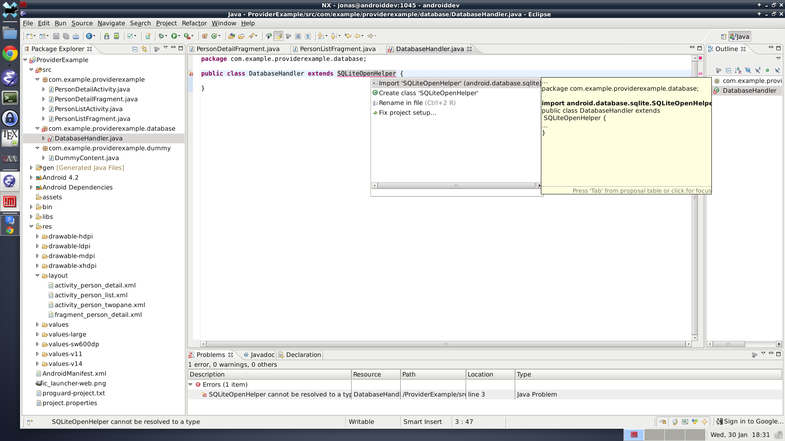

Save. Now, we need to implement the needed methods. Put the text cursor instead
somewhere in "DatabaseHandler", **CTRL-1**, "Add unimplemented methods..".

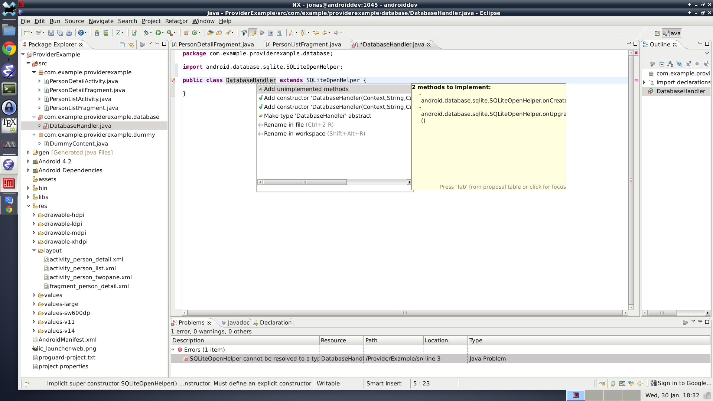

The last thing missing is a constructor. Instead of adding a default one, add
the following code to the top of the class:

```java
    private static DatabaseHandler singleton;

	public static DatabaseHandler getInstance(final Context context) {
		if (singleton == null) {
			singleton = new DatabaseHandler(context);
		}
		return singleton;
	}

	private static final int DATABASE_VERSION = 1;
	private static final String DATABASE_NAME = "providerExample";

	private final Context context;

	public DatabaseHandler(Context context) {
		super(context, DATABASE_NAME, null, DATABASE_VERSION);
        // Good idea to use process context here
		this.context = context.getApplicationContext();
	}
```

Your project should no longer show any errors.

Before we make any further changes to the DatabaseHandler, let's make a
Person class. We are now doing a kind of DAO/ORM approach
(*Data As Objects* and *Object Relational Mapping* respectively), basically
a Class will be responsible for converting the data stored in the database
into variables useable in the Java code. The advantage of this approach,
as compared to dealing with the database directly everytime is primarily
safety and convenience. Putting all the code associated with a type of
data in one place is good practice. If the data defnition has to change, then
that class should be the only place that needs changes ideally.

### Creating the Person class
So, once again create a new Class in the database package. I name my class
"Person" to be consistent. I now decide that every person will have a
first name, last name (never make that assumption in real life) and a "bio".

The class is fairly simple but it's easier to show the finished result:

```java
package com.example.providerexample.database;

import android.content.ContentValues;
import android.database.Cursor;

/**
 * A class representation of a row in table "Person".
 */
public class Person {

	// SQL convention says Table name should be "singular", so not Persons
	public static final String TABLE_NAME = "Person";
	// Naming the id column with an underscore is good to be consistent
	// with other Android things. This is ALWAYS needed
	public static final String COL_ID = "_id";
	// These fields can be anything you want.
	public static final String COL_FIRSTNAME = "firstname";
	public static final String COL_LASTNAME = "lastname";
	public static final String COL_BIO = "bio";

	// For database projection so order is consistent
	public static final String[] FIELDS = { COL_ID, COL_FIRSTNAME, COL_LASTNAME,
		COL_BIO };

	/*
	 * The SQL code that creates a Table for storing Persons in.
	 * Note that the last row does NOT end in a comma like the others.
	 * This is a common source of error.
	 */
	public static final String CREATE_TABLE =
			"CREATE TABLE " + TABLE_NAME + "("
			+ COL_ID + " INTEGER PRIMARY KEY,"
			+ COL_FIRSTNAME + " TEXT NOT NULL DEFAULT '',"
			+ COL_LASTNAME + " TEXT NOT NULL DEFAULT '',"
			+ COL_BIO + " TEXT NOT NULL DEFAULT ''"
			+ ")";

	// Fields corresponding to database columns
	public long id = -1;
	public String firstname = "";
	public String lastname = "";
	public String bio = "";

	/**
	 * No need to do anything, fields are already set to default values above
	 */
	public Person() {
	}

	/**
	 * Convert information from the database into a Person object.
	 */
	public Person(final Cursor cursor) {
		// Indices expected to match order in FIELDS!
		this.id = cursor.getLong(0);
		this.firstname = cursor.getString(1);
		this.lastname = cursor.getString(2);
		this.bio = cursor.getString(3);
	}

	/**
	 * Return the fields in a ContentValues object, suitable for insertion
	 * into the database.
	 */
	public ContentValues getContent() {
		final ContentValues values = new ContentValues();
		// Note that ID is NOT included here
		values.put(COL_FIRSTNAME, firstname);
		values.put(COL_LASTNAME, lastname);
		values.put(COL_BIO, bio);

		return values;
	}
}
```

This class contains all the necessary information to create the required database
things for Persons. Note that the fields themselves are public. This is a really
simple class and I therefor consider getters/setters for those variables to be
highly unnecessary.

I also want to write the result of the CREATE_TABLE string in plain text here:

```SQL
CREATE TABLE Person(
  _id INTEGER PRIMARY KEY,
  firstname TEXT NOT NULL DEFAULT '',
  lastname TEXT NOT NULL DEFAULT '',
  bio TEXT NOT NULL DEFAULT '')
```

This create a table in the database. Every table of a database must have an ID.
By saying that *_id* is an *integer* and the *primary key*, we make it into the
ID. *primary key* has the property that every newly inserted row gets a unique ID.
The database will **never** allow two rows to have the same ID. This is a very
good thing.

The other columns all share the same definitions, they are *TEXT* which defaults
to the empty string (just like they do in the class Person). But note that it
also has *NOT NULL* defined. This means that they are not allowed to be NULL, ever.
If you try to set a firstname to NULL, the database will protest and crash.
Putting restrictions on the fields inside the database is a good idea, because
you can then be sure of what will come out of it. However, think it through
properly beforehand to make sure you don't set yourself up for stupid things later.

### Finishing the DatabaseHandler
Let's turn our attention back to the DatabaseHandler we created earlier. First
thing we need to do is put something inside *onCreate*. This method is called
the *first* time the database is opened. We need to create our table inside it.
Because we wrote the relevant code in the Person class, this is very straight
forward. This is the complete *onCreate* method:

```java
    @Override
	public void onCreate(SQLiteDatabase db) {
		db.execSQL(Person.CREATE_TABLE);
	}
```

Let's leave *onUpgrade* for now. This method is called when the database version
has changed. The version is defined at the top of the class in constant
**DATABASE_VERSION = 1**. If you need to make changes to your database, increment
this value and put any relevant code to *upgrade* the database in the *onUpgrade*
method. We will get to an example of this later. All you have to have in mind now
is that you can change the database as your app matures. You can add/remove tables,
and also add columns to existing tables. The only thing you can't do is remove
columns from existing tables (not a big problem, just ignore them in that case) or
add/change/remove the *restrictions* you defined in the table creation
(like *NOT NULL*).

OK, the table will be created for us, good. But we can't really do anything yet.
We need to be able to do stuff with persons. To start with, we want to be able to
do the following: add/update a person, remove a person and of course get a person.

Let's add methods corresponding to those cases:

```java
	public synchronized Person getPerson(final long id) {
		// TODO
		return null;
	}

	public synchronized boolean putPerson(final Person person) {
		// TODO
        return false;
	}

	public synchronized int removePerson(final Person person) {
		// TODO
        return 0;
	}
```

Some might notice that I do not have separate insert and update methods.
Your case might differ but I find that if my code wants to save a person,
then it wants to save it regardless if it is already present in the
database or not.

The methods are *synchronized* because we are going to use loaders to load
the data, which run on separate background threads. So we want to make sure
that only one thread is reading/writing at any given time.

Let's start with *getPerson*. All we want to do is query the database
for a row with the specified id.

```java
	public synchronized Person getPerson(final long id) {
		final SQLiteDatabase db = this.getReadableDatabase();
		final Cursor cursor = db.query(Person.TABLE_NAME,
				Person.FIELDS, Person.COL_ID + " IS ?",
				new String[] { String.valueOf(id) }, null, null, null, null);
		if (cursor == null || cursor.isAfterLast()) {
			return null;
		}

		Person item = null;
		if (cursor.moveToFirst()) {
			item = new Person(cursor);
		}
		cursor.close();

		return item;
	}
```

Here the advantage of the Person's cursor constructor should be clear. But make
sure the cursor is pointing at the correct row before with *moveToFirst* or
*moveToNext* depending on your use case. The method returns **null** if no
row in the database matches the specified ID. IDs start at 1, so -1 is
always a safe default value. The delete method is similarly simple:

```java
	public synchronized int removePerson(final Person person) {
		final SQLiteDatabase db = this.getWritableDatabase();
		final int result = db.delete(Person.TABLE_NAME,
				Person.COL_ID + " IS ?",
				new String[] { Long.toString(person.id) });

        return result;
	}
```

The result is the number
of rows that were deleted. In this case it should never be anything except
zero or one. Finally, *putPerson*. It's a little longer, but that's only
because it is both an insert and an update method.

First, we try to update the person. If that fails, we insert it instead.

```java
	public synchronized boolean putPerson(final Person person) {
		boolean success = false;
		int result = 0;
		final SQLiteDatabase db = this.getWritableDatabase();

		if (person.id > -1) {
			result += db.update(Person.TABLE_NAME, person.getContent(),
					Person.COL_ID + " IS ?",
					new String[] { String.valueOf(person.id) });
		}

		if (result > 0) {
			success = true;
		} else {
			// Update failed or wasn't possible, insert instead
			final long id = db.insert(Person.TABLE_NAME, null,
					person.getContent());

			if (id > -1) {
				person.id = id;
				success = true;
			}
		}

		return success;
	}
```

Our ORM layer is complete.

Using Person as a base, it is fairly easy to add additional tables to the database.
All we need are get,put and remote methods in the database handler and we're set.
Changes made to Person basically never have to touch the database handler ever.
This will be very nice during development when you realize that you forgot
a column that you needed. Only changes needed in the Person class, reinstall the
app and you're good to go.


## Making a ContentProvider
We will only be concerned with reading data from the database with our provider
at first, so making it will be quick. First we need to create the shell of the
class. The newer versions of the Android SDK make this easy. Go to New ->
Other. Then select "Android Object".


Next select "ContentProvider" from the list!


It's important to keep in mind what you type as your authority. It should
basically be "your.package.provider", but that's just a convention I read
somewhere. It would be anything but must be unique to your application.
I went with *com.example.providerexample.provider*. Exported isn't needed
as we will only use the provider internally so far.

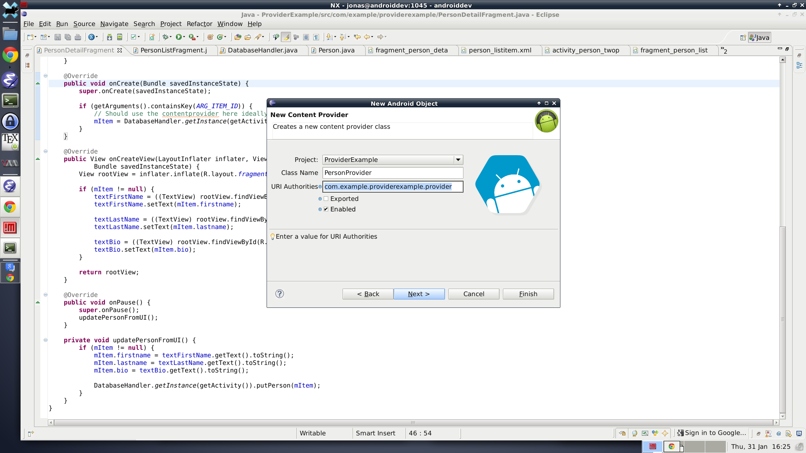

By default, the wizard places the class in your main package. I want it to
be in the database package. Remember if you move it, you must change the
corresponding package name in the *AndroidManifest.xml* or your app will
crash on start.

Now you have the shell of a Provider done! This is the complete generated class:

```java
public class PersonProvider extends ContentProvider {
	public PersonProvider() {
	}

	@Override
	public int delete(Uri uri, String selection, String[] selectionArgs) {
		// Implement this to handle requests to delete one or more rows.
		throw new UnsupportedOperationException("Not yet implemented");
	}

	@Override
	public String getType(Uri uri) {
		// TODO: Implement this to handle requests for the MIME type of the data
		// at the given URI.
		throw new UnsupportedOperationException("Not yet implemented");
	}

	@Override
	public Uri insert(Uri uri, ContentValues values) {
		// TODO: Implement this to handle requests to insert a new row.
		throw new UnsupportedOperationException("Not yet implemented");
	}

	@Override
	public boolean onCreate() {
		// TODO: Implement this to initialize your content provider on startup.
		return false;
	}

	@Override
	public Cursor query(Uri uri, String[] projection, String selection,
			String[] selectionArgs, String sortOrder) {
		// TODO: Implement this to handle query requests from clients.
		throw new UnsupportedOperationException("Not yet implemented");
	}

	@Override
	public int update(Uri uri, ContentValues values, String selection,
			String[] selectionArgs) {
		// TODO: Implement this to handle requests to update one or more rows.
		throw new UnsupportedOperationException("Not yet implemented");
	}
}
```

Since we only care about reading persons so far, we only need to concern
ourselves with the *onCreate* and *query* methods. We also need to come
up with a *URI*, basically a path that we can use to differentiate between
different queries.

Start by adding the following fields at the top of the Provider:

```java
	// All URIs share these parts
	public static final String AUTHORITY = "com.example.providerexample.provider";
	public static final String SCHEME = "content://";

	// URIs
	// Used for all persons
	public static final String PERSONS = SCHEME + AUTHORITY + "/person";
	public static final Uri URI_PERSONS = Uri.parse(PERSONS);
	// Used for a single person, just add the id to the end
	public static final String PERSON_BASE = PERSONS + "/";
```

Change the *onCreate* method to:

```java
    @Override
	public boolean onCreate() {
		return true;
	}
```

The *query* method is not that complicated either. This is the shell we
are working from:

```java
    @Override
	public Cursor query(Uri uri, String[] projection, String selection,
			String[] selectionArgs, String sortOrder) {
		Cursor result = null;
		if (URI_PERSONS.equals(uri)) {

		}
		else if (uri.toString().startsWith(PERSON_BASE)) {

		}
		else {
		throw new UnsupportedOperationException("Not yet implemented");
		}

		return result;
	}
```

Either you can get a cursor of all persons, or you can get a cursor with
a single person. The single person operation is already implemented in
getPerson(), so doing basically the same we get:

```java
            final long id = Long.parseLong(uri.getLastPathSegment());
			result = DatabaseHandler
					.getInstance(getContext())
					.getReadableDatabase()
					.query(Person.TABLE_NAME, Person.FIELDS,
							Person.COL_ID + " IS ?",
							new String[] { String.valueOf(id) }, null, null,
							null, null);
```

Getting all persons is even simpler:

```java
			result = DatabaseHandler
					.getInstance(getContext())
					.getReadableDatabase()
					.query(Person.TABLE_NAME, Person.FIELDS, null, null, null,
							null, null, null);
```

You can note that I am outright ignoring the selection and order parameters
of the provider method, as well as the projection. I don't care about selections
so far because there is no use case for them yet. The projection I ignore
because the only valid projection is defined in the Person class, as far as
I care. This is very convenient if we ever make use of a ViewBinder.

We're not completely done yet however. The provider works, in the sense that
it will return cursors with the result. But we also want that to update
whenever the database updates. To do that, we have to notify listeners
on the URIs that things have changed. To do that, turn back to the
DatabaseHandler.

Every time something changes, we must notify the listeners. Only two methods
change the content, and that is *removePerson* and *putPerson*. First, make
a new method that does the actual notifying:

```java
	private void notifyProviderOnPersonChange() {
		context.getContentResolver().notifyChange(
				PersonProvider.URI_PERSONS, null, false);
	}
```

And call that method any time something changes. *putPerson* gets this added
before its return statement:

```java
        if (success) {
			notifyProviderOnPersonChange();
		}
```

And similarly for *removePerson*:

```java
		if (result > 0) {
			notifyProviderOnPersonChange();
		}
```

Last, make the Provider listen for such notifications. Add the following
line to both blocks in *query*:

```Java
result.setNotificationUri(getContext().getContentResolver(), URI_PERSONS);
```

That's it. We're done. Here are the complete *PersonProvider* and *DatabaseHandler* classes before we move on to displaying the content:

```java
public class DatabaseHandler extends SQLiteOpenHelper {

	private static DatabaseHandler singleton;

	public static DatabaseHandler getInstance(final Context context) {
		if (singleton == null) {
			singleton = new DatabaseHandler(context);
		}
		return singleton;
	}

	private static final int DATABASE_VERSION = 1;
	private static final String DATABASE_NAME = "providerExample";

	private final Context context;

	public DatabaseHandler(Context context) {
		super(context, DATABASE_NAME, null, DATABASE_VERSION);
		this.context = context;
	}

	@Override
	public void onCreate(SQLiteDatabase db) {
		db.execSQL(Person.CREATE_TABLE);
	}

	@Override
	public void onUpgrade(SQLiteDatabase db, int oldVersion, int newVersion) {
	}

	public synchronized Person getPerson(final long id) {
		final SQLiteDatabase db = this.getReadableDatabase();
		final Cursor cursor = db.query(Person.TABLE_NAME, Person.FIELDS,
				Person.COL_ID + " IS ?", new String[] { String.valueOf(id) },
				null, null, null, null);
		if (cursor == null || cursor.isAfterLast()) {
			return null;
		}

		Person item = null;
		if (cursor.moveToFirst()) {
			item = new Person(cursor);
		}
		cursor.close();
		return item;
	}

	public synchronized boolean putPerson(final Person person) {
		boolean success = false;
		int result = 0;
		final SQLiteDatabase db = this.getWritableDatabase();

		if (person.id > -1) {
			result += db.update(Person.TABLE_NAME, person.getContent(),
					Person.COL_ID + " IS ?",
					new String[] { String.valueOf(person.id) });
		}

		if (result > 0) {
			success = true;
		} else {
			// Update failed or wasn't possible, insert instead
			final long id = db.insert(Person.TABLE_NAME, null,
					person.getContent());

			if (id > -1) {
				person.id = id;
				success = true;
			}
		}

		if (success) {
			notifyProviderOnPersonChange();
		}

		return success;
	}

	public synchronized int removePerson(final Person person) {
		final SQLiteDatabase db = this.getWritableDatabase();
		final int result = db.delete(Person.TABLE_NAME,
				Person.COL_ID + " IS ?",
				new String[] { Long.toString(person.id) });

		if (result > 0) {
			notifyProviderOnPersonChange();
		}
		return result;
	}

	private void notifyProviderOnPersonChange() {
		context.getContentResolver().notifyChange(
				PersonProvider.URI_PERSONS, null, false);
	}
}
```

```java
public class PersonProvider extends ContentProvider {

	// All URIs share these parts
	public static final String AUTHORITY = "com.example.providerexample.provider";
	public static final String SCHEME = "content://";

	// URIs
	// Used for all persons
	public static final String PERSONS = SCHEME + AUTHORITY + "/person";
	public static final Uri URI_PERSONS = Uri.parse(PERSONS);
	// Used for a single person, just add the id to the end
	public static final String PERSON_BASE = PERSONS + "/";

	public PersonProvider() {
	}

	@Override
	public int delete(Uri uri, String selection, String[] selectionArgs) {
		// Implement this to handle requests to delete one or more rows.
		throw new UnsupportedOperationException("Not yet implemented");
	}

	@Override
	public String getType(Uri uri) {
		// TODO: Implement this to handle requests for the MIME type of the data
		// at the given URI.
		throw new UnsupportedOperationException("Not yet implemented");
	}

	@Override
	public Uri insert(Uri uri, ContentValues values) {
		// TODO: Implement this to handle requests to insert a new row.
		throw new UnsupportedOperationException("Not yet implemented");
	}

	@Override
	public boolean onCreate() {
		return true;
	}

	@Override
	public Cursor query(Uri uri, String[] projection, String selection,
			String[] selectionArgs, String sortOrder) {
		Cursor result = null;
		if (URI_PERSONS.equals(uri)) {
			result = DatabaseHandler
					.getInstance(getContext())
					.getReadableDatabase()
					.query(Person.TABLE_NAME, Person.FIELDS, null, null, null,
							null, null, null);
            result.setNotificationUri(getContext().getContentResolver(), URI_PERSONS);
        } else if (uri.toString().startsWith(PERSON_BASE)) {
			final long id = Long.parseLong(uri.getLastPathSegment());
			result = DatabaseHandler
					.getInstance(getContext())
					.getReadableDatabase()
					.query(Person.TABLE_NAME, Person.FIELDS,
							Person.COL_ID + " IS ?",
							new String[] { String.valueOf(id) }, null, null,
							null, null);
		     result.setNotificationUri(getContext().getContentResolver(), URI_PERSONS);
        } else {
			throw new UnsupportedOperationException("Not yet implemented");
		}

		return result;
	}

	@Override
	public int update(Uri uri, ContentValues values, String selection,
			String[] selectionArgs) {
		// TODO: Implement this to handle requests to update one or more rows.
		throw new UnsupportedOperationException("Not yet implemented");
	}
}
```

## Making some layouts
Let's get ready to use our new database. Obviously the layouts provided by the wizard
aren't optimized to display information about our Persons. Let's remedy that!

### Detail view
Persons are display in "fragment_person_detail.xml", replace the contents
with the following to get a more interesting view:

```XML
<ScrollView xmlns:android="http://schemas.android.com/apk/res/android"
    android:id="@+id/personDetailScrollView"
    android:layout_width="fill_parent"
    android:layout_height="fill_parent" >

    <LinearLayout
        android:layout_width="fill_parent"
        android:layout_height="fill_parent"
        android:orientation="vertical" >

        <TextView
            android:layout_width="wrap_content"
            android:layout_height="wrap_content"
            android:layout_marginLeft="8dp"
            android:fontFamily="sans-serif-light"
            android:text="Firstname"
            android:textColor="#ff707070"
            android:textSize="18sp" />

        <EditText
            android:id="@+id/textFirstName"
            android:layout_width="fill_parent"
            android:layout_height="wrap_content"
            android:hint="Your first name"
            android:inputType="textPersonName"
            android:textColor="#ff222222"
            android:textSize="20sp" />

        <TextView
            android:layout_width="wrap_content"
            android:layout_height="wrap_content"
            android:layout_marginLeft="8dp"
            android:fontFamily="sans-serif-light"
            android:text="Lastname"
            android:textColor="#ff707070"
            android:textSize="18sp" />

        <EditText
            android:id="@+id/textLastName"
            android:layout_width="fill_parent"
            android:layout_height="wrap_content"
            android:hint="Your last name"
            android:inputType="textPersonName"
            android:textColor="#ff222222"
            android:textSize="20sp" />

        <TextView
            android:layout_width="wrap_content"
            android:layout_height="wrap_content"
            android:layout_marginLeft="8dp"
            android:fontFamily="sans-serif-light"
            android:text="Biography"
            android:textColor="#ff707070"
            android:textSize="18sp" />

        <EditText
            android:id="@+id/textBio"
            android:layout_width="match_parent"
            android:layout_height="wrap_content"
            android:hint="Type anything here"
            android:inputType="textMultiLine|textAutoCorrect"
            android:textColor="#ff222222"
            android:textSize="20sp" />
    </LinearLayout>

</ScrollView>
```

This will look like this:


The whole thing is wrapped in a scrollview to allow people to have really long
biographies even on small screens.

### List item view
Using Androids provided one or two line list items is so boring. Let's make
something nicer.

#### Create a drawable
Create a folder called "drawable" in the res folder. It should live beside the other
drawable folders you already got.

Then create a new XML file named "rounded_corners_white.xml" in drawables. Put
the following in it:

```XML
<?xml version="1.0" encoding="utf-8"?>
<layer-list xmlns:android="http://schemas.android.com/apk/res/android">

    <!-- Bottom 2dp Shadow -->
    <item
        android:left="0dp"
        android:right="0dp" >
        <shape  android:shape="rectangle">

            <solid android:color="#d8d8d8" />
            <corners android:radius="2dp" />

        </shape>
    </item>

    <!-- White Top color -->
    <item android:bottom="2dp"
        android:left="0dp"
        android:right="0dp" >

        <shape  android:shape="rectangle">

        <solid android:color="#FFFFFF" />
        <corners android:radius="2dp" />

        </shape>

    </item>

</layer-list>
```

#### Create the list item

Create a new layout xml file called "person_listitem.xml", make the
root view a linear vertical layout.

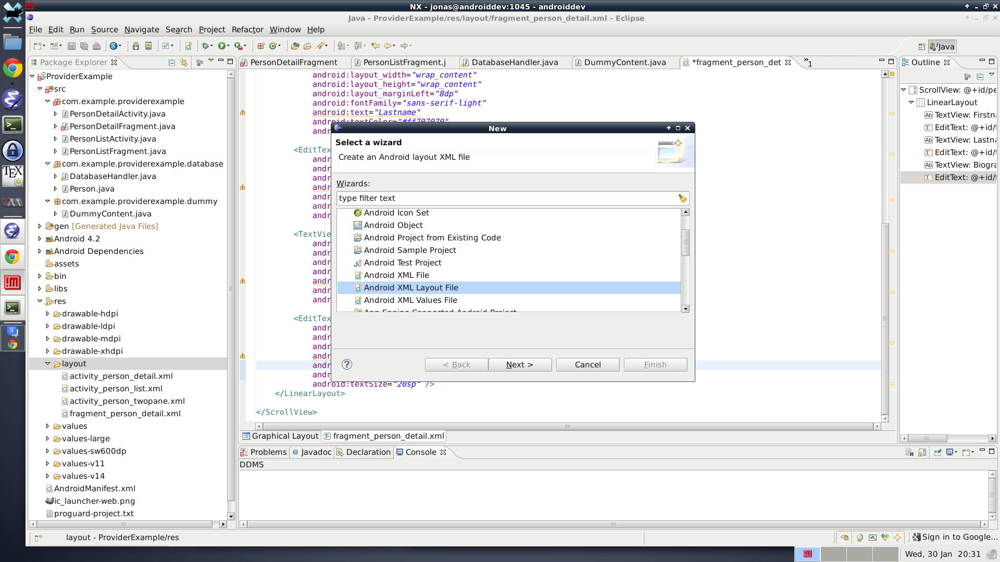

You want the file contents to look like:

```XML
<?xml version="1.0" encoding="utf-8"?>
<LinearLayout xmlns:android="http://schemas.android.com/apk/res/android"
    xmlns:tools="http://schemas.android.com/tools"
    android:layout_width="match_parent"
    android:layout_height="wrap_content"
    android:layout_marginTop="6dp"
    android:background="@drawable/rounded_corners_white"
    android:descendantFocusability="blocksDescendants"
    android:orientation="vertical"
    android:paddingBottom="8dp"
    android:paddingLeft="0dp"
    android:paddingRight="0dp"
    tools:context=".MainActivity" >

    <TextView
        android:id="@+id/cardFirstName"
        android:layout_width="match_parent"
        android:layout_height="wrap_content"
        android:paddingLeft="4dp"
        android:paddingRight="4dp"
        android:textColor="#ff707070"
        android:textSize="23sp" />

    <TextView
        android:id="@+id/cardLastName"
        android:layout_width="match_parent"
        android:layout_height="wrap_content"
        android:paddingLeft="4dp"
        android:paddingRight="4dp"
        android:textColor="#ff707070"
        android:textSize="23sp" />

    <View
        android:id="@+id/cardStatus"
        android:layout_width="fill_parent"
        android:layout_height="1dp"
        android:layout_marginTop="4dp"
        android:background="@android:color/holo_blue_light"
        android:visibility="visible" />

    <TextView
        android:id="@+id/cardDescription"
        android:layout_width="match_parent"
        android:layout_height="wrap_content"
        android:layout_marginTop="4dp"
        android:maxLines="3"
        android:paddingLeft="4dp"
        android:paddingRight="4dp"
        android:textColor="#ff8d8d8d"
        android:textSize="16sp" />

</LinearLayout>
```

#### Create a new list layout
Create a new layout xml called "fragment_person_list.xml". This is
its content:

```XML
<?xml version="1.0" encoding="utf-8"?>
<ListView xmlns:android="http://schemas.android.com/apk/res/android"
    android:layout_width="match_parent"
    android:layout_height="match_parent"
    android:id="@id/android:list"
    android:divider="@android:color/transparent"
    android:dividerHeight="12dp"
    android:drawSelectorOnTop="true"
    android:background="#e5e5e5"
    android:paddingLeft="16dp"
    android:paddingRight="16dp"
    />
```

This is a straight up list view with a grey background and it draws
selectors on top. The items in the list will now look like this:

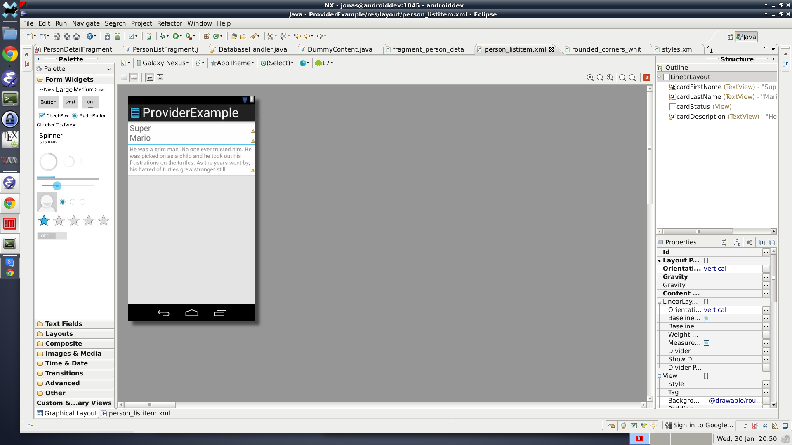

Because of the background, I want to move the location of some margins so the
correct background is rendered at that location.

*activity_person_twopange* only margins and layout weights changed:
```XML
<LinearLayout xmlns:android="http://schemas.android.com/apk/res/android"
    xmlns:tools="http://schemas.android.com/tools"
    android:layout_width="match_parent"
    android:layout_height="match_parent"
    android:layout_marginRight="16dp"
    android:divider="?android:attr/dividerHorizontal"
    android:orientation="horizontal"
    android:showDividers="middle"
    tools:context=".PersonListActivity" >

    <!--
    This layout is a two-pane layout for the Persons
    master/detail flow. See res/values-large/refs.xml and
    res/values-sw600dp/refs.xml for an example of layout aliases
    that replace the single-pane version of the layout with
    this two-pane version.

    For more on layout aliases, see:
    http://developer.android.com/training/multiscreen/screensizes.html#TaskUseAliasFilters
    -->

    <fragment
        android:id="@+id/person_list"
        android:name="com.example.providerexample.PersonListFragment"
        android:layout_width="0dp"
        android:layout_height="match_parent"
        android:layout_weight="1"
        tools:layout="@layout/fragment_person_list" />

    <FrameLayout
        android:id="@+id/person_detail_container"
        android:layout_width="0dp"
        android:layout_height="match_parent"
        android:layout_weight="2" />

</LinearLayout>
```

And same deal for *activity_person_list*:
```XML
<fragment xmlns:android="http://schemas.android.com/apk/res/android"
    xmlns:tools="http://schemas.android.com/tools"
    android:id="@+id/person_list"
    android:name="com.example.providerexample.PersonListFragment"
    android:layout_width="match_parent"
    android:layout_height="match_parent"
    tools:context=".PersonListActivity"
    tools:layout="@layout/fragment_person_list" />
```

## Make the app use the new layouts and load the data
By now you should have one or two compiler errors because we removed
some things that was used in the fragments. Now we fix the errors
by making use of our new layouts instead.

### Fixing details fragment
Open "PersonDetailFragment.java" and you should be presented with this class:

```java
public class PersonDetailFragment extends Fragment {
    /**
     * The fragment argument representing the item ID that this fragment
     * represents.
     */
    public static final String ARG_ITEM_ID = "item_id";

    /**
     * The dummy content this fragment is presenting.
     */
    private DummyContent.DummyItem mItem;

    /**
     * Mandatory empty constructor for the fragment manager to instantiate the
     * fragment (e.g. upon screen orientation changes).
     */
    public PersonDetailFragment() {
    }

    @Override
    public void onCreate(Bundle savedInstanceState) {
        super.onCreate(savedInstanceState);

        if (getArguments().containsKey(ARG_ITEM_ID)) {
            // Load the dummy content specified by the fragment
            // arguments. In a real-world scenario, use a Loader
            // to load content from a content provider.
            mItem = DummyContent.ITEM_MAP.get(getArguments().getString(ARG_ITEM_ID));
        }
    }

    @Override
    public View onCreateView(LayoutInflater inflater, ViewGroup container,
            Bundle savedInstanceState) {
        View rootView = inflater.inflate(R.layout.fragment_person_detail, container, false);

        // Show the dummy content as text in a TextView.
        if (mItem != null) {
            ((TextView) rootView.findViewById(R.id.person_detail)).setText(mItem.content);
        }

        return rootView;
    }
}
```

Starting from the top, we have to change from the dummy class to the
Person class, use the databasehandler to get the person object and
finally use the new layout we made earlier.

Additionally, we will save any updates we make in the onPause method.
That way, the content is saved everytime the screen goes off or the
fragment goes away.

The result:

```java
public class PersonDetailFragment extends Fragment {
    /**
     * The fragment argument representing the item ID that this fragment
     * represents.
     */
    public static final String ARG_ITEM_ID = "item_id";

    /**
     * The person this fragment is presenting.
     */
    private Person mItem;

    /**
     * The UI elements showing the details of the Person
     */
    private TextView textFirstName;
    private TextView textLastName;
    private TextView textBio;

    /**
     * Mandatory empty constructor for the fragment manager to instantiate the
     * fragment (e.g. upon screen orientation changes).
     */
    public PersonDetailFragment() {
    }

    @Override
    public void onCreate(Bundle savedInstanceState) {
        super.onCreate(savedInstanceState);

        if (getArguments().containsKey(ARG_ITEM_ID)) {
        	// Should use the contentprovider here ideally
            mItem = DatabaseHandler.getInstance(getActivity()).getPerson(getArguments().getLong(ARG_ITEM_ID));
        }
    }

    @Override
    public View onCreateView(LayoutInflater inflater, ViewGroup container,
            Bundle savedInstanceState) {
        View rootView = inflater.inflate(R.layout.fragment_person_detail, container, false);

        if (mItem != null) {
            textFirstName = ((TextView) rootView.findViewById(R.id.textFirstName));
            textFirstName.setText(mItem.firstname);

            textLastName = ((TextView) rootView.findViewById(R.id.textLastName));
            textLastName.setText(mItem.lastname);

            textBio = ((TextView) rootView.findViewById(R.id.textBio));
            textBio.setText(mItem.bio);
        }

        return rootView;
    }

    @Override
    public void onPause() {
    	super.onPause();
    	updatePersonFromUI();
    }

    private void updatePersonFromUI() {
    	if (mItem != null) {
    		mItem.firstname = textFirstName.getText().toString();
    		mItem.lastname = textLastName.getText().toString();
    		mItem.bio = textBio.getText().toString();

    		DatabaseHandler.getInstance(getActivity()).putPerson(mItem);
        }
    }
}
```

#### Why not use the provider here?
It would be good practice to use a Loader to fetch the Person from the Provider,
if only just because the data would be loaded on a background thread. Right
now the fragment is fetching the person on the UI thread.

First, I wanted to show how to use an SQLite database without a ContentProvider.
As you can see, the changes from some kind of ArrayAdapter situation are quite
minimal in the fragments/activities.

Second, fetching the data on a background thread is just about the only
benefit we will get from using a Loader in the detail fragment. We **DON'T**
want the data to auto update in here like we want it to do in the List.
Because consider if it is possible that the data is changed somewhere else,
maybe you implement some kind of synchronization service. It would be really
bad user experience to have your entire item change as you were editing it.

Fetching a single item on the UI thread is fine for now. If you have more
advanced ideas in mind, yes you should use a Loader.

### Fixing list view
First we need to use the layout defined in "fragment_person_list.xml". This is
more or less only because I want a grey background in the list.

Add:
```java
    @Override
    public View onCreateView(LayoutInflater inflater, ViewGroup container, Bundle savedInstanceState) {
    	return inflater.inflate(R.layout.fragment_person_list, null);
    }
```

Next we set the adapter using a *SimpleCursorAdapter*.
Initially it has a null cursor. The data is loaded using a *Loader*.
So in *onCreate*, change from:

```java
		// TODO: replace with a real list adapter.
		setListAdapter(new ArrayAdapter<DummyContent.DummyItem>(getActivity(),
				android.R.layout.simple_list_item_activated_1,
				android.R.id.text1, DummyContent.ITEMS));
```

to:
```java
setListAdapter(new SimpleCursorAdapter(getActivity(),
				R.layout.person_listitem, null, new String[] {
						Person.COL_FIRSTNAME, Person.COL_LASTNAME,
						Person.COL_BIO }, new int[] { R.id.cardFirstName,
						R.id.cardLastName, R.id.cardDescription }, 0));

		// Load the content
		getLoaderManager().initLoader(0, null, new LoaderCallbacks<Cursor>() {
			@Override
			public Loader<Cursor> onCreateLoader(int id, Bundle args) {
				return new CursorLoader(getActivity(),
						PersonProvider.URI_PERSONS, Person.FIELDS, null, null,
						null);
			}

			@Override
			public void onLoadFinished(Loader<Cursor> loader, Cursor c) {
				((SimpleCursorAdapter) getListAdapter()).swapCursor(c);
			}

			@Override
			public void onLoaderReset(Loader<Cursor> arg0) {
				((SimpleCursorAdapter) getListAdapter()).swapCursor(null);
			}
		});
```

As a last step, update the *onListItemClick* method to utilize the Cursor instead.

```java
	@Override
	public void onListItemClick(ListView listView, View view, int position,
			long id) {
		super.onListItemClick(listView, view, position, id);

		// Notify the active callbacks interface (the activity, if the
		// fragment is attached to one) that an item has been selected.
		mCallbacks.onItemSelected(getListAdapter().getItemId(position));
	}
```

But, we must also change the callback interface to use a Long instead of
a String to match our database ID and what the Fragment expects.


Make suitable changes everywhere. In the same file update the dummyCallback:

```java
private static Callbacks sDummyCallbacks = new Callbacks() {
		@Override
		public void onItemSelected(long id) {
		}
	};
```

And in PersonListActivity update *onItemSelected*:

```java
    @Override
    public void onItemSelected(long id) {
        if (mTwoPane) {
            // In two-pane mode, show the detail view in this activity by
            // adding or replacing the detail fragment using a
            // fragment transaction.
            Bundle arguments = new Bundle();
            arguments.putLong(PersonDetailFragment.ARG_ITEM_ID, id);
            PersonDetailFragment fragment = new PersonDetailFragment();
            fragment.setArguments(arguments);
            getSupportFragmentManager().beginTransaction()
                    .replace(R.id.person_detail_container, fragment)
                    .commit();

        } else {
            // In single-pane mode, simply start the detail activity
            // for the selected item ID.
            Intent detailIntent = new Intent(this, PersonDetailActivity.class);
            detailIntent.putExtra(PersonDetailFragment.ARG_ITEM_ID, id);
            startActivity(detailIntent);
        }
    }
```
## Add a new button
Running the app now should present an empty list. Not that interesting!
We need to be able to add some items. Just implement a menu item for that:

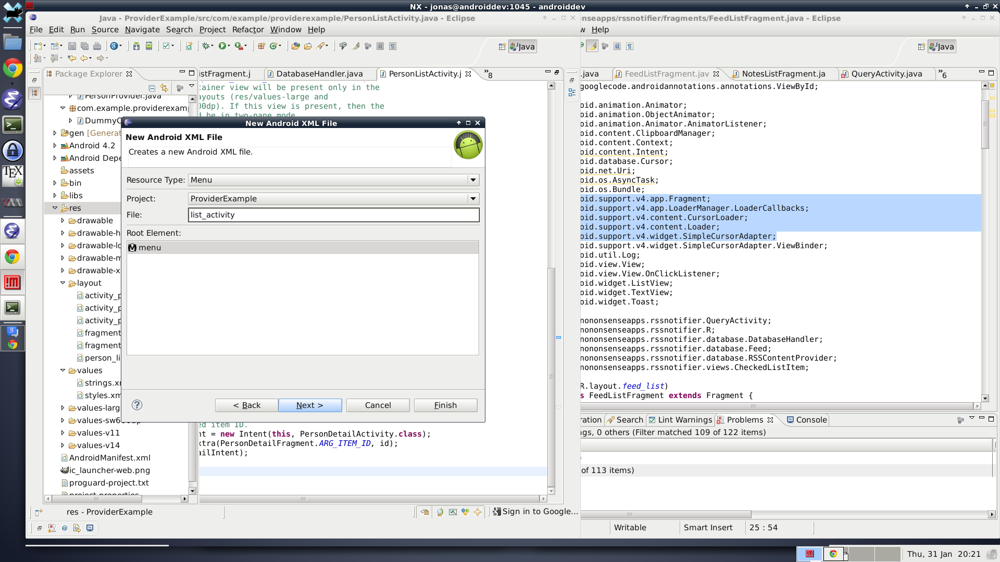

```XML
<?xml version="1.0" encoding="utf-8"?>
<menu xmlns:android="http://schemas.android.com/apk/res/android" >

    <item
        android:id="@+id/newPerson"
        android:orderInCategory="1"
        android:showAsAction="ifRoom|withText"
        android:title="New"/>

</menu>
```

Inflate the menu and click handler in *PersonListActivity*:

```Java
	@Override
	public boolean onCreateOptionsMenu(Menu menu) {
		MenuInflater inflater = getMenuInflater();
		inflater.inflate(R.menu.list_activity, menu);
		return true;
	}

	@Override
	public boolean onOptionsItemSelected(MenuItem item) {
		boolean result = false;
		if (R.id.newPerson == item.getItemId()) {
			result = true;
			// Create a new person.
			Person p = new Person();
			DatabaseHandler.getInstance(this).putPerson(p);
			// Open a new fragment with the new id
			onItemSelected(p.id);
		}

		return result;
	}
```

Change to LongExtras in *PersonListActivity.java*
```Java
    @Override
    protected void onCreate(Bundle savedInstanceState) {
        super.onCreate(savedInstanceState);
        setContentView(R.layout.activity_person_detail);

        // Show the Up button in the action bar.
        getActionBar().setDisplayHomeAsUpEnabled(true);

        // savedInstanceState is non-null when there is fragment state
        // saved from previous configurations of this activity
        // (e.g. when rotating the screen from portrait to landscape).
        // In this case, the fragment will automatically be re-added
        // to its container so we don't need to manually add it.
        // For more information, see the Fragments API guide at:
        //
        // http://developer.android.com/guide/components/fragments.html
        //
        if (savedInstanceState == null) {
            // Create the detail fragment and add it to the activity
            // using a fragment transaction.
            Bundle arguments = new Bundle();
            arguments.putLong(PersonDetailFragment.ARG_ITEM_ID,
                    getIntent().getLongExtra(PersonDetailFragment.ARG_ITEM_ID, -1));
            PersonDetailFragment fragment = new PersonDetailFragment();
            fragment.setArguments(arguments);
            getSupportFragmentManager().beginTransaction()
                    .add(R.id.person_detail_container, fragment)
                    .commit();
        }
    }
```

## Add some data
Before shipping off your newly created app you might want to add some data to it.
You can do so by updating the onCreate method of the DatabaseHandler.
First you create a new person object, populate it with the desired values and
finally insert it using the insert method of the db object. Eventually it should look like below.

Do note that ideally any predefined data should be loaded from resources
and not be hardcoded like done here. But doing so is beyond this tutorial.

```java
	@Override
	public void onCreate(SQLiteDatabase db) {
		db.execSQL(Person.CREATE_TABLE);

		Person person = new Person();
		person.firstname = "Sylvester";
		person.lastname = "Stallone";
		person.bio = "...";
		db.insert(Person.TABLE_NAME, null, person.getContent());

		person.firstname = "Danny";
		person.lastname = "DeVito";
		person.bio = "...";
		db.insert(Person.TABLE_NAME, null, person.getContent());
	}
```

## Final result
Nexus 7

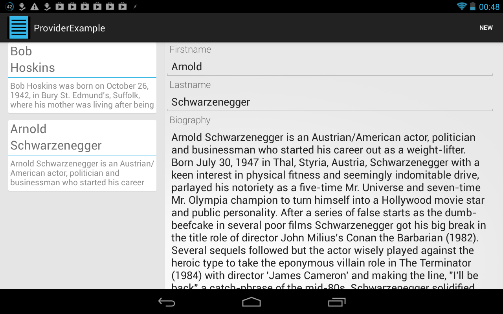

Galaxy Nexus List

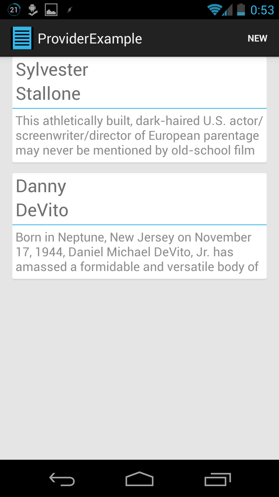

Galaxy Nexus Details


## Explaining the details

Let's clarify a few of the things I skipped over quite fast.

### URIs

A URI is pretty much an address. You are quite familiar with URIs like
*http://www.google.com*. The URIs which point to information handled by
ContentProviders always start with *content://* instead of *http://*, but
you see that the structure is the same. This part is what is called the
**scheme**. A URI pointing to a file on the SD card would have the scheme:
*file://*.

The next part of the URI is the **authority**. This identifies which entity
(in our case, which provider in which app) should handle the request. In the
example above the authority was *www.google.com*. In the case of content
providers, the authority typically involves your package name (like
*com.example.providerexample*) in order to guarantee its uniqueness to your
provider. Some Google document says its convention to put *.provider* at
the end. It makes sure the system knows to pass the request along to our
content provider and not one of the others in the system.

The final part of the URI is the **path**. The google address does not have
a path. If it looked like: *http://www.google.com/a/folder/img.png* then
*/a/folder/img.png* would be the path. This is meaningless to the system
and only relevant to our content provider. We can define anything we
want here. We use it to differentiate between different requests. For
example: */persons* used in a query will retrieve a list of all persons.
*/persons/id* will fetch only a single person with the designated id.
*/squirrels* won't lead to anything since the provider doesn't know
what to do with that. But it could. It's all up to the developer.

### SQLite

There are (many) books written about SQL so I'm not even going to try to
condense everything thing in here. Instead I'll focus on what you have seen
and what is obviously still missing.

SQLite is merely the language dialect we are using. We are using it because
it is what Google decided to support natively in Android. The point is
to create and manage a database. A relational database (there are other kinds)
stores its information in tables. Each entry corresponds to a row in the
table, with each kind of information stored in the different columns.

A concrete example:

<table>
  <tr>
    <td>ID</td>
    <td>name</td>
    <td>phonenumber</td>
  </tr>
  <tr>
    <td>1</td>
    <td>Bob</td>
    <td>326346</td>
  </tr>
  <tr>
    <td>2</td>
    <td>Alice</td>
    <td>326346</td>
  </tr>
</table>

Created by:

```SQL
CREATE TABLE contact(
  INT ID primary key,
  TEXT name,
  TEXT phonenumber)
```

This table would store people with their phone numbers and possibly other
information as well. Now, if you wanted to support more than one phone number
per person, this structure would break down. There is no way to make a list
of phone numbers (without doing string parsing) for a single person here. To
do that, you'd need to take advantage of the *relational* part of the database.
We'd have to store the phonenumbers in a separate table. For example:

<table>
  <tr>
    <td>ID</td>
    <td>name</td>
  </tr>
  <tr>
    <td>1</td>
    <td>Bob</td>
  </tr>
  <tr>
    <td>2</td>
    <td>Alice</td>
  </tr>
</table>

<table>
  <tr>
    <td>ID</td>
    <td>contactid</td>
    <td>phonenumber</td>
  </tr>
  <tr>
    <td>1</td>
    <td>2</td>
    <td>326346</td>
  </tr>
  <tr>
    <td>2</td>
    <td>1</td>
    <td>326346</td>
  </tr>
</table>


Created by:

```SQL
CREATE TABLE contact(
  INT ID primary key,
  TEXT name);

CREATE TABLE phonenumber(
  INT ID primary key,
  INT contactid,
  TEXT phonenumber);
```

Now we can store an arbitrary amount of phone numbers per contact. This might
seem messy, and it kind of is. But, once you get the hang of it you can do
some pretty powerful and convenient things too. One thing that I missed above
was to have a *CONSTRAINT* on the table. Right now, the phonenumbers table
has a column called contactid, but the database doesn't care what you insert
there. Consider instead the following modification to the code:

```SQL
CREATE TABLE phonenumber(
  INT ID primary key,
  INT contactid REFERENCES contact,
  TEXT phonenumber)
```

Now we are telling the database that this number should match a valid ID
in the contacts table. If we do something that will make this statement
false, the database will throw an exception. This is good because it
prevents us from doing stupid things. Like filling the database with a
bunch of orphan phone numbers. We can make things easy on ourselves however
by adding a *CONFLICT RESOLUTION CLAUSE*:

```SQL
CREATE TABLE phonenumber(
  INT ID primary key,
  INT contactid REFERENCES contact ON DELETE CASCADE,
  TEXT phonenumber)
```

If we delete a contact and that contact is linked to phone numbers, now
those phone numbers are deleted automatically at the same time. So the database
will not break because we delete a contact. We can also constrain the
phone numbers to be unique:

```SQL
CREATE TABLE phonenumber(
  INT ID primary key,
  INT contactid REFERENCES contact ON DELETE CASCADE,
  TEXT phonenumber,
  UNIQUE(phonenumber))
```

This means that only one contact can be linked to a single phone number, which
is probably a lot like reality. But consider something like a hard line, a
home phone. That is probably linked to an entire family, logically speaking.
We can make the database understand that by doing:

```SQL
CREATE TABLE phonenumber(
  INT ID primary key,
  INT contactid REFERENCES contact ON DELETE CASCADE,
  TEXT phonenumber,
  UNIQUE(contactid, phonenumber))
```

Now we are only constraining the phonenumber to be unique within a person's
collection of numbers. So a number can not occur more than once for a single
persons, which makes sense. But a number can belong to several persons, which
is true in case of home phones.

#### Queries

To get information from the database, we will be doing a **query**. The
result is returned in a Cursor. The basic SQL syntax of a query is:

```SQL
SELECT columnname1, columnname2
  FROM table
  WHERE something IS something
  ORDER BY columname;
```

This returns a cursor with all the rows that matched the *WHERE*-part. But,
you can do queries on multiple tables at once and do internal queries as
part of your *WHERE*-clause. We can also do some arithmetic and string operations.
In Android we will probably tend to use the suitable helper classes. They
work fine unless you want to do things that concern multiple tables at
once (JOINED queries). You have already seen the syntax being of the form:

```Java
db.query(tableName, columnsToReturn, "something IS ?", someValue,
    null, null,
    orderByColumnName,
    null);
```

You can see that this matches quite literally the parts from the SQL code.
The nulls represents possible other constraints
that I will not mention.

The question mark however is useful. While you could have put your argument
directly in the string instead of the question mark, that might break at times.
Namely when that argument is a string. For example:

**WHERE column1 IS Arthur**

would crash because the correct syntax would be

**WHERE column1 IS 'Arthur'**

And those quotes are easy to forget. Putting the question mark in the java
call means that the implementation will wrap your argument in quotes for you.
It's basically safer, and means you have a fixed where-clause as a static
string somewhere, and only change the argument array.

To order the data, just specify the columnname and whether to do it "ASC" or
"DESC" (forwards or backwards). To sort the names in the list in the app
alphabetically, just do something like:

```Java
final Cursor cursor = db.query(Person.TABLE_NAME, Person.FIELDS,
				Person.COL_ID + " IS ?", new String[] { String.valueOf(id) },
				null, null,
                Person.COL_FIRSTNAME,
                , null);
```

To do it backwards replace the OrderBy part with (don't forget the space):

```Java
Person.COL_FIRSTNAME + " DESC"
```

#### Changing data
Operating on tables is possible using *insert*, *update* or *delete*. They
are probably self explanatory from their names. Just like queries, *update*
and *delete* accept WHERE-clauses. Which means you can update or delete
a whole bunch of items fulfilling some criteria. Like deleting all
people over 50 years old if you had that data.

Another thing that is handy to know about is how to change tha database
tables. SQLite will not allow you to delete columns from tables, but
you can add columns or rename them. Adding columns after the fact has
a few restrictions though:

- The column may not have a PRIMARY KEY or UNIQUE constraint.
- The column may not have a default value of CURRENT_TIME, CURRENT_DATE, CURRENT_TIMESTAMP, or an expression in parentheses.
- If a NOT NULL constraint is specified, then the column must have a default value other than NULL.
- If foreign key constraints are enabled and a column with a REFERENCES clause is added, the column must have a default value of NULL.

The only thing relevant is probably the first one, they can not have a
unique constraint which could be something of a bummer. The syntax you could
put in your Databasehandler's onUpdate method would be something like:

```Java
public void onUpdate(SQLiteDatabase db, int oldVersion, int newVersion) {
    if (oldVersion < 2) {
        db.execSQL("ALTER TABLE contact ADD COLUMN INT age NOT NULL DEFAULT 25");
    }
}
```

Just remember to update your original create table statement for fresh installs.
They will NOT get a call to onUpdate.
